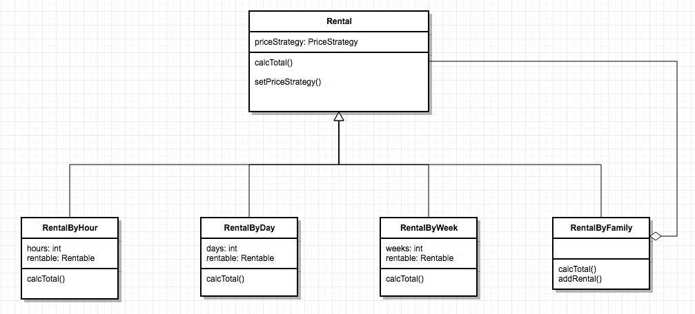
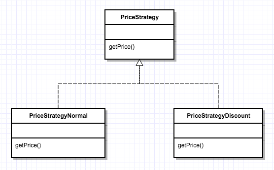

# rental-fdv

This is an application to manage rentals of bikes.

## Design

The design is mainly based on the composite pattern, Rental is the component. RentalByHour, RentalByDay and RentalByWeek are the leafs and RentalByFamily is the composite.



For price calculation the strategy pattern is used to apply a normal price or a price with discount. By default all rentals uses the normal prices strategy. In the case of RentalByFamily the strategy could changes depending on the number of bikes to be rented by a client.



The Rentable interface is defined to abstract the object to be rented.

## Code Struct

Ant build tool was configured to clean, compile and test this project. The unit tests are located in a different source folder but in the same package level of the code, like a Maven project.

- root
   - src/main/java/...
   - src/test/java/...

Ant version: Apache Ant(TM) version 1.9.4

## Test

### Test Coverage

The coverage of the unit tests developed is 99.5%. For more information open coverage/index.html in a web browser.

### Test Execution

Unit tests can be executed with the next Ant command line from the root of the project.

```ant test```

